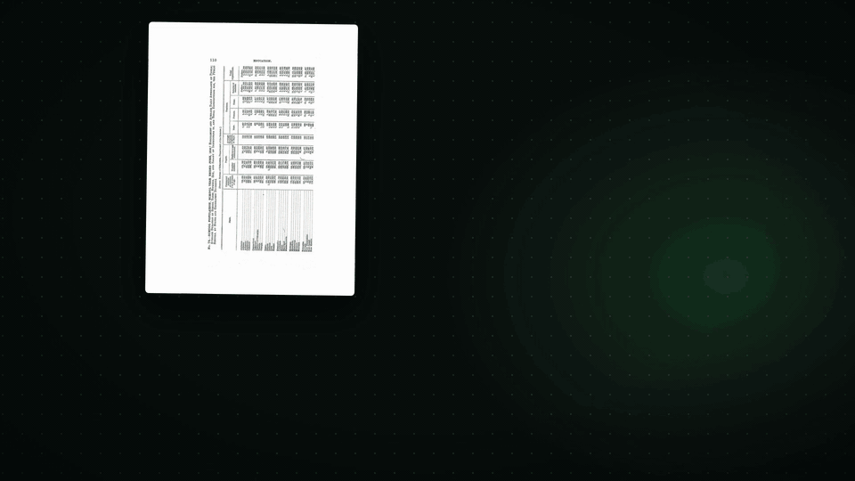

<div align="center">

<h1>everymd</h1>

### Docling reads it. AI checks every page. You get Markdown your AI can use.

**PDFs, scans, images, Office files, web pages, e-books and email → clean Markdown.
Every page with an image is checked against the original by an AI copy-editor.**

<a href="LICENSE"></a>
<a href="https://github.com/arjungowdal4601/everymd/actions/workflows/tests.yml"></a>


<a href="https://github.com/docling-project/docling"></a>
<a href="#set-it-up-with-your-ai-coding-assistant"></a>

**[PDF · Scans · Images · Word · PowerPoint · Web pages & URLs · E-books · Email](#any-document-in)**

<br><br>

<picture>
  <source media="(prefers-reduced-motion: reduce)" srcset="docs/assets/everymd-demo-poster.png">
  
</picture>

<table>
<tr>
<td align="center" width="33%"><h3>Every page checked</h3>against its own image by an AI copy-editor<br><sub>every change is labelled in the file</sub></td>
<td align="center" width="33%"><h3>78 pages, steady memory</h3>measured peak: 4.32 GiB on a 1920 scanned report<br><sub>Docling only; read truly one page at a time</sub></td>
<td align="center" width="33%"><h3>≈ $0.001 a page</h3>30 sample pages for about $0.03<br><sub>gpt-6-luna at low reasoning, estimated</sub></td>
</tr>
</table>

**[Before and after](#before-and-after) · [Any document](#any-document-in) · [Quick start](#quick-start) · [With your AI agent](#set-it-up-with-your-ai-coding-assistant) · [In your project](#use-it-in-your-project) · [What you get](#what-you-get) · [Limits](#status-and-limits)**

</div>

---

## Before and after

The same scanned page ([our generated sample](samples/inputs/scanned_report.pdf)):
[Docling alone](samples/outputs/docling-only/scanned_report/scanned_report.p0001.md)
next to [everymd](samples/outputs/scanned_report/scanned_report.p0001.md).

| Docling alone | everymd |
|---|---|
| `## Quarterly Field Report: Water Sensor Pilot` | `# Quarterly Field Report: Water Sensor Pilot` |
| ``<br>*(no description)* | ``<br>`> **AI-generated description:** Bar chart titled “Sensors online by region” comparing Q1 2026 and Q2 2026 sensors for North (120, 150), South (95, 88)…` |
| `$$u _ { \ } g = ( Q 2 - Q 1 ) / Q 1 \times 1 0 0 \, u _ { \ } g$$` | `$$g = (Q2 - Q1) / Q1 \times 100$$` |

Three fixes on one page, each checked against the page image and noted in the
file. The AI can still be wrong: check numbers that matter against the source.

**How it works:** Docling converts one page → the copy-editor compares that
page's Markdown with its image and fixes what the image clearly shows is wrong →
the page file is written and its memory released → the next page. A short note
carried from page to page keeps tables, lists and headings continuous.

## Any document in

Paged inputs are checked page by page against an image of the page: Word files
and slides are laid out by LibreOffice, and web pages are printed to A4 by
Chromium. E-books and email have no pages, so Docling reads them directly and
the AI writes only the brief. Every row below is a real sample in
[samples/](samples/README.md):

| Input | Sample | What happened | Output |
|---|---|---|---|
| **PDF** | `report.pdf` | Cleaned up Docling's garbled formula; made the title a document heading; described the chart | [report.md](samples/outputs/report/report.md) |
| **Scan** (PDF or image) | `scanned_report.pdf` | Corrected the OCR-garbled formula, fixed the title level, described the chart | [scanned_report.md](samples/outputs/scanned_report/scanned_report.md) |
| **Word** (.docx .doc .odt .rtf) | `proposal.docx` | Made the title the H1, removed garbled bullet characters, described the chart | [proposal.md](samples/outputs/proposal/proposal.md) |
| **PowerPoint** (.pptx .ppt .odp) | `board_deck.pptx` | Added the chart's data labels and caption; speaker notes kept (.pptx) | [board_deck.md](samples/outputs/board_deck/board_deck.md) |
| **Web page or URL** | `page.html` | Described the chart; restored the code block's line breaks; removed the site footer | [page.md](samples/outputs/page/page.md) |
| **Image** (.png .jpg …) | `invoice.png` | Put the invoice details and totals in reading order; wrote a caption | [invoice.md](samples/outputs/invoice/invoice.md) |
| **E-book** (.epub) | `booklet.epub` | Read natively, with chapters kept; no page images, so no page check; brief written | [booklet.md](samples/outputs/booklet/booklet.md) |
| **Email** (.eml .msg) | `update.eml` | Headers and body read natively; no page check; brief written | [update.md](samples/outputs/update/update.md) |

Spreadsheets aren't supported yet. See [limits](#status-and-limits).

## Quick start

Install and start Docker first. Your machine needs no local Python for conversion.
From a terminal:

```bash
git clone https://github.com/arjungowdal4601/everymd.git
cd everymd
docker compose build
docker compose run --rm app python -m everymd samples/inputs/report.pdf --no-ai
```

The last command is free of model calls and needs no key. Its files are in
`outputs/report/`. Budget roughly 5 GB of disk for the image, build and model
caches; a first build can take 10+ minutes. Docling downloads its local models
on first use and reuses the `model-cache` volume. Allow at least 4 GB of Docker
memory; dense scans can need more.

The same command takes any supported input:

```bash
docker compose run --rm app python -m everymd samples/inputs/proposal.docx --no-ai
docker compose run --rm app python -m everymd https://en.wikipedia.org/wiki/Markdown --no-ai
```

Their files go to `outputs/proposal/` and `outputs/en.wikipedia.org-Markdown/`;
a URL needs network access.

For AI editing, copy `.env.example` to `.env` yourself and enter your provider
key there. Never paste the key into chat. Set `EVERYMD_REASONING_EFFORT=low`
to match the sample measurements, then omit `--no-ai`. AI calls cost money.

## Set it up with your AI coding assistant

Paste this into Claude Code, Codex or Cursor:

```text
Help me set up everymd. Use Docker as the supported runtime.
Check whether Docker is installed and its daemon is running.
If unavailable, explain how to install/start it for my OS.
Never install system software without asking me.
Clone https://github.com/arjungowdal4601/everymd.git and cd into everymd.
Read README.md and AGENTS.md before changing anything.
Copy .env.example to .env only if .env does not already exist.
Ask me to enter my own provider key into .env in my editor.
Never open, read, print or log .env, and never ask for the key in chat.
Never run docker compose config, which expands environment values.
Explain the roughly 5 GB image/build/model-cache disk budget.
Warn that the first Docker build can take 10+ minutes.
Run docker compose build.
Run docker compose run --rm app python -m everymd samples/inputs/report.pdf --no-ai.
This is Docling only: free of paid model calls, no key required.
Show the output paths printed by the CLI.
Only with my explicit agreement, run one sample with the AI on.
Use gpt-6-luna at low reasoning; the sample estimate is a fraction of a cent.
Explain that the estimate varies and is not verified provider billing.
Then explain the output folder in these five lines:
report.md is the complete document.
report.p0001.md and later page files are ready-made chunks with page numbers.
report.brief.md and report.index.md are AI-written navigation, when applicable.
images/ contains linked pictures and table screenshots.
report.json records settings, notes, tokens and estimated cost.
```

## Use it in your project

**A. Your files through Docker.** From the checkout, mount a folder containing
your own input; quote paths with spaces:

```bash
docker compose run --rm -v "$PWD/samples/inputs:/data:ro" app python -m everymd /data/report.pdf --out outputs --no-ai
```

Replace the mounted host folder and filename with yours. Remove `--no-ai`
only when you intend to make paid calls.

**B. Python inside the image.** Your service can build `FROM everymd:0.1.0`
or run as a Compose service with the image built above:

```python
from everymd import convert

result = convert("samples/inputs/report.pdf", output_dir="outputs",  # any supported file or an https:// URL
                 resolution="high", use_gpu=False, llm_layer=False, batch_size=1)
print(result.markdown_path)
print(result.page_paths)  # ready-made chunks; front-matter carries page numbers
print(result.brief_path, result.index_path)  # present with AI when applicable
print(result.report["estimated_cost_usd"])
```

**C. Your own Python environment.** Git installation is supported by the package
metadata; Docker remains the supported complete runtime:

```bash
pip install git+https://github.com/arjungowdal4601/everymd
```

You need Git and Python 3.13+, LibreOffice for Office page images, and
`playwright install chromium` for web pages (Linux also needs Chromium's system
libraries). See [native setup](docs/native.md). No PyPI package is published.

Three integration tips: use one page file as one chunk with its page number;
run everymd in its own process because Deep Agents profiles are process-wide;
only pass trusted URLs.

## What you get

For an input named `<name>` (for example `report.pdf` or `proposal.docx`), the CLI writes `outputs/<name>/`:

| File | Contents |
|---|---|
| `<name>.md` | Stitched Markdown, metadata, page anchors and labelled AI edits |
| `<name>.p0001.md`, … | One file per page, with page number and previous/next links; slides use `.s0001.md` |
| `<name>.brief.md` | AI-written summary with page references; web gets an outline, EPUB/email a paragraph |
| `<name>.index.md` | AI-written page ranges and topics for paged documents; excludes web |
| `<name>.docling.json` | Docling elements with provenance |
| `images/` | Linked pictures and table screenshots; AI descriptions are labelled |
| `report.json` | Status, settings, notes, tokens, estimated USD cost and elapsed seconds |

The brief/index need the AI layer; single images get a caption instead.
EPUB/email have no page files or page images, so the copy-editor is skipped.
Every AI change is marked in the Markdown as `<!-- ai-edited: … -->` and listed in `report.json` under `pages[].changes`.
Speaker notes from `.pptx` files are attached to their slides. A staging folder replaces a prior result
only on success; failures are retained in a hidden `.name.failed/` folder.
Different inputs with the same stem receive separate output folders.
See [copy-editor and output details](docs/copy-editor.md).

## Inputs, models, cost and speed

Inputs: digital/scanned PDF; images; DOCX/DOC/ODT/RTF; PPTX/PPT/ODP;
HTML or trusted URLs; EPUB; EML/MSG. Type comes from file content.
Office files render through LibreOffice, web through Chromium. The CLI supports
`--resolution low|medium|high|max`, `--batch-size N` and `--no-ai`.

Default model: `openai:gpt-6-luna`; production reasoning defaults to medium.
Switch via `EVERYMD_MODEL=provider:model` in your own `.env` or pass `model=`
to `convert()`. OpenAI, Anthropic and Google integrations are pinned in the
image; other providers need their LangChain integration. Page-image editing
needs vision and tool calling. See [model settings](docs/copy-editor.md).

Measured samples use CPU Docker, high resolution, batch size 1 and Luna **low**
reasoning. The two-page report took **31.7 s / $0.0020** estimated; the two-page
scan took **40.8 s / $0.0019**, or **18.2 s / $0** with AI off. All samples took
**401 s / $0.0294**. These are sample measurements, not guarantees or bills.
See [samples/README.md](samples/README.md) for dates, hardware, tokens and all results.

## Status and limits

Early **v0.1**. Review important numbers and conditions against the page.

- Dense scanned tables remain difficult; low reasoning can leave a link-heavy
  infobox as text or restart a list item continued from a previous page.
  Production medium reasoning has not been evaluated.
- Page files preserve printed fragments: a word split across pages stays split.
  Large batches hold more page images; keep batch size small for long files.
- Spreadsheets, folders, empty inputs and protected/damaged PDFs are rejected.
  Missing Office rendering falls back to native text without image editing;
  legacy DOC/PPT require LibreOffice.
- URL browsers and linked resources can reach internal addresses. Use trusted
  URLs and network isolation in services; see [SECURITY.md](SECURITY.md).
- Docker on a Mac uses CPU. Model downloads and dense OCR add time and memory.
- The Wikipedia sample output is CC BY-SA 4.0, separately attributed in
  [samples/README.md](samples/README.md).

Optional guides: [Jupyter / VS Code](docs/notebook.md),
[native Mac setup](docs/native.md), [historical plans](docs/history/README.md).

## Contributing and licence

See [CONTRIBUTING.md](CONTRIBUTING.md), [AGENTS.md](AGENTS.md) and
[CODE_OF_CONDUCT.md](CODE_OF_CONDUCT.md). everymd code is
[MIT](LICENSE); dependency/model/sample notices are in [THIRD_PARTY.md](THIRD_PARTY.md).
