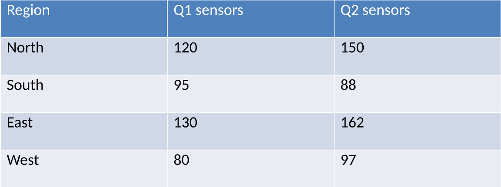

<!-- slide: 2 -->

## Sensor rollout by region

| Region   |   Q1 sensors |   Q2 sensors |
|----------|--------------|--------------|
| North    |          120 |          150 |
| South    |           95 |           88 |
| East     |          130 |          162 |
| West     |           80 |           97 |

**Speaker notes:** South is the only region that shrank: seven sensors failed after the June storms.
