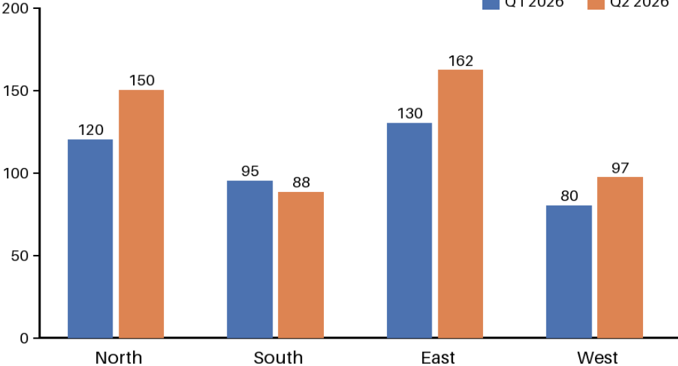

<!-- slide: 3 -->

## Growth by region

### Sensors online by region

Q1 2026

Q2 2026

> **AI-generated description:** Grouped bar chart of sensors online by region. Q1 2026 values: North 120, South 95, East 130, West 80. Q2 2026 values: North 150, South 88, East 162, West 97. East has the highest value in both quarters; South is the only region that decreases from Q1 to Q2.

**Speaker notes:** Point out that East grew fastest. Ask the board to approve the Q3 budget.

<!-- ai-edited: Added the chart's data labels and a descriptive caption; set the chart title as a subsection heading. -->
