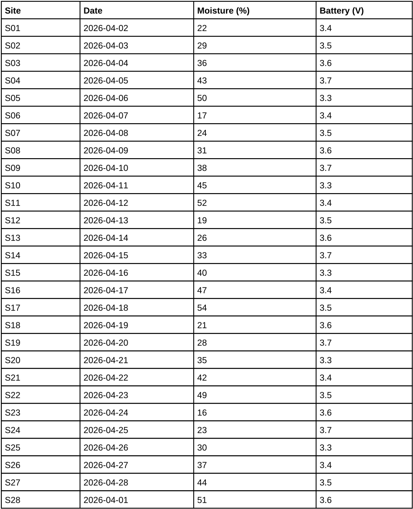

<!-- page: 1 -->

# Sensor Field Log

## 1 Readings

Soil moisture and battery voltage for every site in the spring survey.

| Site | Date | Moisture (%) | Battery (V) |
|---|---|---:|---:|
| S01 | 2026-04-02 | 22 | 3.4 |
| S02 | 2026-04-03 | 29 | 3.5 |
| S03 | 2026-04-04 | 36 | 3.6 |
| S04 | 2026-04-05 | 43 | 3.7 |
| S05 | 2026-04-06 | 50 | 3.3 |
| S06 | 2026-04-07 | 17 | 3.4 |
| S07 | 2026-04-08 | 24 | 3.5 |
| S08 | 2026-04-09 | 31 | 3.6 |
| S09 | 2026-04-10 | 38 | 3.7 |
| S10 | 2026-04-11 | 45 | 3.3 |
| S11 | 2026-04-12 | 52 | 3.4 |
| S12 | 2026-04-13 | 19 | 3.5 |
| S13 | 2026-04-14 | 26 | 3.6 |
| S14 | 2026-04-15 | 33 | 3.7 |
| S15 | 2026-04-16 | 40 | 3.3 |
| S16 | 2026-04-17 | 47 | 3.4 |
| S17 | 2026-04-18 | 54 | 3.5 |
| S18 | 2026-04-19 | 21 | 3.6 |
| S19 | 2026-04-20 | 28 | 3.7 |
| S20 | 2026-04-21 | 35 | 3.3 |
| S21 | 2026-04-22 | 42 | 3.4 |
| S22 | 2026-04-23 | 49 | 3.5 |
| S23 | 2026-04-24 | 16 | 3.6 |
| S24 | 2026-04-25 | 23 | 3.7 |
| S25 | 2026-04-26 | 30 | 3.3 |
| S26 | 2026-04-27 | 37 | 3.4 |
| S27 | 2026-04-28 | 44 | 3.5 |
| S28 | 2026-04-01 | 51 | 3.6 |

<!-- ai-edited: Corrected title heading level to document title (#); retained all table values and screenshot link. -->
