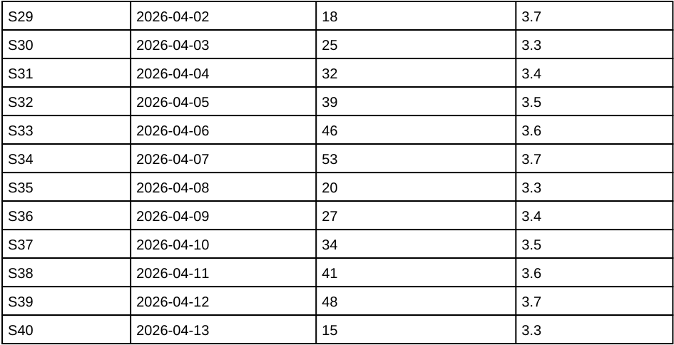

<!-- page: 2 -->

*(table continued from page 1)*

| Site | Date | Moisture (%) | Battery (V) |
|---|---|---:|---:|
| S29 | 2026-04-02 | 18 | 3.7 |
| S30 | 2026-04-03 | 25 | 3.3 |
| S31 | 2026-04-04 | 32 | 3.4 |
| S32 | 2026-04-05 | 39 | 3.5 |
| S33 | 2026-04-06 | 46 | 3.6 |
| S34 | 2026-04-07 | 53 | 3.7 |
| S35 | 2026-04-08 | 20 | 3.3 |
| S36 | 2026-04-09 | 27 | 3.4 |
| S37 | 2026-04-10 | 34 | 3.5 |
| S38 | 2026-04-11 | 41 | 3.6 |
| S39 | 2026-04-12 | 48 | 3.7 |
| S40 | 2026-04-13 | 15 | 3.3 |

These readings come from the spring survey. Volunteers checked every site twice and logged the lower value. Sites in the river valley stayed wetter than the hill sites, as in earlier years. All readings above were taken before the irriga-

<!-- ai-edited: Added the continued table's column headers and continuation marker. -->
