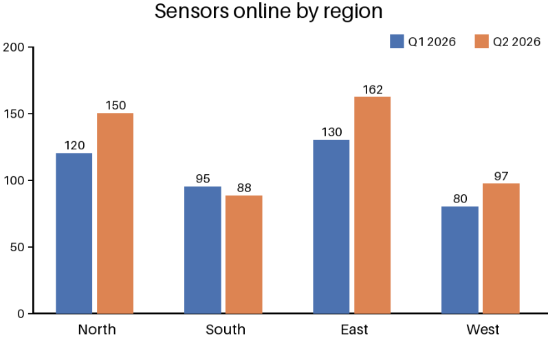

<!-- page: 4 -->

4. Push the probe back in at a depth of 10 cm.
5. Photograph the site and upload the photo.

> **AI-generated description:** Bar chart titled “Sensors online by region” comparing Q1 2026 (blue) with Q2 2026 (orange). North: 120 and 150; South: 95 and 88; East: 130 and 162; West: 80 and 97. The vertical axis ranges from 0 to 200.

<!-- ai-edited: Added a description of the meaningful chart image. -->
