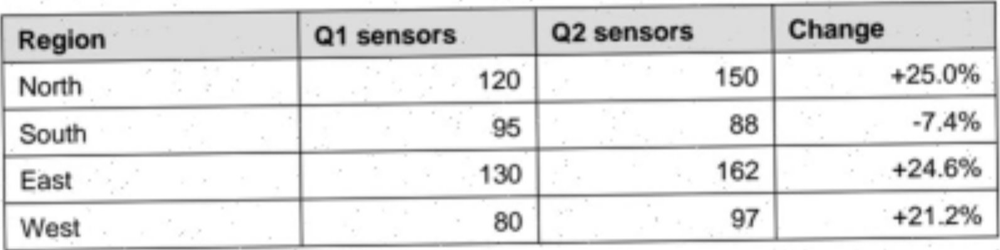
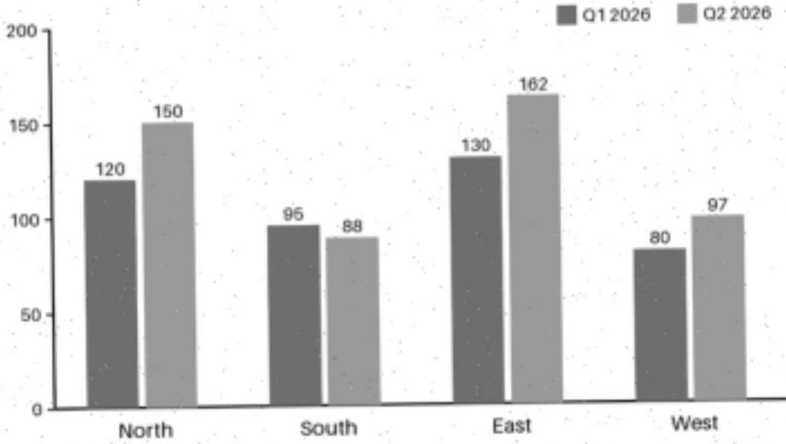
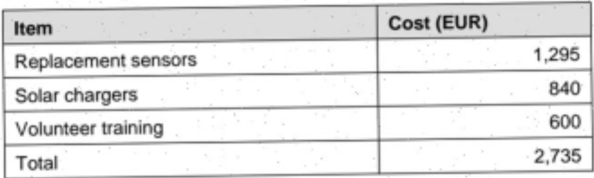

<!-- page: 1 -->

## Quarterly Field Report: Water Sensor Pilot

This report summarises the second quarter of the community water sensor pilot. Volunteers installed soil moisture sensors in four regions and logged how many stayed online.

## 1. Results by region

| Region   |   Q1 sensors |   Q2 sensors | Change   |
|----------|--------------|--------------|----------|
| North    |          120 |          150 | +25.0%   |
| South    |           95 |           88 | -7.4%    |
| East     |          130 |          162 | +24.6%   |
| West     |           80 |           97 | +21.2%   |

## Sensors online by region

Figure 1: Sensors online per region, Q1 and Q2 2026.

## 2. How growth is measured

Quarter-on-quarter growth for a region is computed as:

$$u _ { \ } g = ( Q 2 - Q 1 ) / Q 1 \times 1 0 0 \, u _ { \ } g$$

A negative value means sensors went offline faster than new ones were installed.

<!-- page: 2 -->

## 3. Next steps

- Replace the 7 failed sensors in the South region before October.
- Add a second solar charger to every West site.
- Publish the anonymised readings as open data in Q4.

## 4. Budget for Q3

| Item                |   Cost (EUR) |
|---------------------|--------------|
| Replacement sensors |        1,295 |
| Solar chargers      |          840 |
| Volunteer training  |          600 |
| Total               |        2,735 |

The pilot steering group will review these figures at its next meeting.
