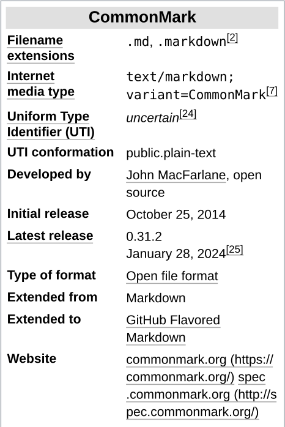

<!-- page: 1 -->


# Markdown

**Markdown**[9] is a [lightweight markup language](https://en.wikipedia.org/wiki/Lightweight_markup_language) for creating [formatted text](https://en.wikipedia.org/wiki/Formatted_text) using a [plain-text editor](https://en.wikipedia.org/wiki/Text_editor). [John Gruber](https://en.wikipedia.org/wiki/John_Gruber) created Markdown in 2004 as an easy-to-read [markup language](https://en.wikipedia.org/wiki/Markup_language).[9] Markdown is widely used for [blogging](https://en.wikipedia.org/wiki/Blog), [instant messaging](https://en.wikipedia.org/wiki/Instant_messaging), and [large language models](https://en.wikipedia.org/wiki/Large_language_models),[10] and also used elsewhere in [online forums](https://en.wikipedia.org/wiki/Online_forums), [collaborative software](https://en.wikipedia.org/wiki/Collaborative_software), [documentation](https://en.wikipedia.org/wiki/Documentation) pages, and [readme files](https://en.wikipedia.org/wiki/README).

The initial description of Markdown[11] contained ambiguities and raised unanswered questions, causing implementations to both intentionally and accidentally diverge from the original version. This was addressed in 2014 when long-standing Markdown contributors released CommonMark, an unambiguous specification and test suite for Markdown.[12]

## History

Markdown was inspired by pre-existing [conventions](https://en.wikipedia.org/wiki/Convention_(norm)) for marking up [plain text](https://en.wikipedia.org/wiki/Plain_text) in [email](https://en.wikipedia.org/wiki/Email) and [usenet](https://en.wikipedia.org/wiki/Usenet) posts,[13] such as the earlier markup languages [setext](https://en.wikipedia.org/wiki/Setext) ([*c.*](https://en.wikipedia.org/wiki/Circa) 1992), [Textile](https://en.wikipedia.org/wiki/Textile_(markup_language)) ([*c.*](https://en.wikipedia.org/wiki/Circa) 2002), and [reStructuredText](https://en.wikipedia.org/wiki/ReStructuredText) ([*c.*](https://en.wikipedia.org/wiki/Circa) 2002).[9]

In 2002, [Aaron Swartz](https://en.wikipedia.org/wiki/Aaron_Swartz) created [atx](https://en.wikipedia.org/wiki/Atx_(markup_language)) and referred to it as "the true structured text format". Gruber created the Markdown language in 2004 with Swartz as his "sounding board".[14] The goal of the language was to enable people "to write using an easy-to-read and easy-to-write plain text format, optionally convert it to structurally valid [XHTML](https://en.wikipedia.org/wiki/XHTML) (or [HTML](https://en.wikipedia.org/wiki/HTML))".[5]

Another key design goal was *readability*, that the language be readable as-is, without looking like it has been marked up with tags or formatting instructions,[9] unlike text formatted with "heavier" [markup languages](https://en.wikipedia.org/wiki/Markup_language), such as [Rich Text Format](https://en.wikipedia.org/wiki/Rich_Text_Format) (RTF), HTML, or even [wikitext](https://en.wikipedia.org/wiki/Wikitext), each of which have obvious in-line tags and formatting instructions which can make the text more difficult for humans to read.

Gruber wrote a [Perl](https://en.wikipedia.org/wiki/Perl) script, Markdown.pl, which converts marked-up text input to valid, [well-formed](https://en.wikipedia.org/wiki/Well-formed_document) XHTML or HTML, encoding angle brackets (&lt;, &gt;) and [ampersands](https://en.wikipedia.org/wiki/Ampersand) (&amp;), which would be misinterpreted as special characters in those languages. It can take the role of a standalone script, a plugin for [Blosxom](https://en.wikipedia.org/wiki/Blosxom) or [Movable Type](https://en.wikipedia.org/wiki/Movable_Type), or of a text filter for [BBEdit](https://en.wikipedia.org/wiki/BBEdit).[5]

## Rise and divergence

As Markdown's popularity grew rapidly, many Markdown [implementations](https://en.wikipedia.org/wiki/Implementation) appeared, driven mostly by the need for additional features such as [tables](https://en.wikipedia.org/wiki/Table_(information)), [footnotes](https://en.wikipedia.org/wiki/Note_(typography)), definition lists,[note 1] and Markdown inside HTML blocks.

The behavior of some of these diverged from the reference implementation, as Markdown was only characterised by an informal [specification](https://en.wikipedia.org/wiki/Specification_(technical_standard))[17] and a [Perl](https://en.wikipedia.org/wiki/Perl) implementation for conversion to HTML.

<!-- ai-edited: Removed the site navigation link; reordered the infobox content into its printed position within the article flow and omitted its labels/values from the text flow where appropriate? Wait image shows infobox; preserve it. Need include table! -->

<!-- page: 2 -->

At the same time, a number of ambiguities in the informal specification had attracted attention.[18] These issues spurred the creation of tools such as Babelmark[19][20] to compare the output of various implementations,[21] and an effort by some developers of Markdown [parsers](https://en.wikipedia.org/wiki/Parsing) for standardization. However, Gruber has argued that complete standardization would be a mistake: "Different sites (and people) have different needs. No one syntax would make all happy."[22]

Gruber avoided using curly braces in Markdown to unofficially reserve them for implementation-specific extensions.[23]

## CommonMark

### Standardization

In 2012, a group of people, including [Jeff Atwood](https://en.wikipedia.org/wiki/Jeff_Atwood) and [John MacFarlane](https://en.wikipedia.org/wiki/John_MacFarlane_(philosopher)), launched what Atwood characterised as a standardization effort.[12]

A community website now aims to "document various tools and resources available to document authors and developers, as well as implementors of the various Markdown implementations".[26]

### Name

In September 2014, Gruber objected to the usage of "Markdown" in the name of this effort and it was rebranded as "CommonMark".[13][27][28] CommonMark.org published several versions of a specification, reference implementation, test suite, and "[plans] to announce a finalized 1.0 spec and test suite in 2019".[29] A finalized 1.0 spec has not been released, as major issues still remain unsolved.[30]

### Adoption

<table><tbody><tr><th colspan="2">CommonMark</th></tr><tr><td><a href="https://en.wikipedia.org/wiki/Filename_extension">Filename extensions</a></td><td>.md, .markdown [2]</td></tr><tr><td><a href="https://en.wikipedia.org/wiki/Media_type">Internet media type</a></td><td>text/markdown; variant=CommonMark [7]</td></tr><tr><td><a href="https://en.wikipedia.org/wiki/Uniform_Type_Identifier">Uniform Type Identifier (UTI)</a></td><td>uncertain [24]</td></tr><tr><td>UTI conformation</td><td>public.plain-text</td></tr><tr><td>Developed by</td><td>[John MacFarlane](https://en.wikipedia.org/wiki/John_MacFarlane_(philosopher)), open source</td></tr><tr><td>Initial release</td><td>October 25, 2014</td></tr><tr><td><a href="https://en.wikipedia.org/wiki/Software_release_life_cycle">Latest release</a></td><td>0.31.2 January 28, 2024 [25]</td></tr><tr><td>Type of format</td><td><a href="https://en.wikipedia.org/wiki/Open_file_format">Open file format</a></td></tr><tr><td>Extended from</td><td>Markdown</td></tr><tr><td>Extended to</td><td>GitHub Flavored Markdown</td></tr><tr><td>Website</td><td><a href="https://commonmark.org/">commonmark.org (https:// commonmark.org/)</a> <a href="http://spec.commonmark.org/">spec .commonmark.org (http://s pec.commonmark.org/)</a></td></tr></tbody></table>



Nonetheless, several websites and projects have adopted CommonMark, including [Codeberg](https://en.wikipedia.org/wiki/Codeberg), [Discourse](https://en.wikipedia.org/wiki/Discourse_(software)), [GitHub](https://en.wikipedia.org/wiki/GitHub), [GitLab](https://en.wikipedia.org/wiki/GitLab), [Reddit](https://en.wikipedia.org/wiki/Reddit), [Qt](https://en.wikipedia.org/wiki/Qt_(software)), [Stack Exchange](https://en.wikipedia.org/wiki/Stack_Exchange) ([Stack Overflow](https://en.wikipedia.org/wiki/Stack_Overflow)), and [Swift](https://en.wikipedia.org/wiki/Swift_(programming_language)).

In March 2016, two relevant informational Internet [RFCs](https://en.wikipedia.org/wiki/Request_for_Comments) were published:

- RFC [7763 (https://www.rfc-editor.org/rfc/rfc7763)](https://www.rfc-editor.org/rfc/rfc7763) - "The text/markdown Media Type,"[2] Informational. Introduces [MIME](https://en.wikipedia.org/wiki/MIME) type text/markdown.
- RFC [7764 (https://www.rfc-editor.org/rfc/rfc7764)](https://www.rfc-editor.org/rfc/rfc7764) - "Guidance on Markdown: Design Philosophies, Stability Strategies, and Select Registrations,"[7] Informational. Discusses and registers the variants [MultiMarkdown](https://en.wikipedia.org/wiki/MultiMarkdown), GitHub Flavored Markdown (GFM), [Pandoc](https://en.wikipedia.org/wiki/Pandoc), and Markdown Extra (among others).[31]

## Variants

Websites including [Bitbucket](https://en.wikipedia.org/wiki/Bitbucket), [Diaspora](https://en.wikipedia.org/wiki/Diaspora_(social_network)), [Discord](https://en.wikipedia.org/wiki/Discord),[32] GitHub,[33] [OpenStreetMap](https://en.wikipedia.org/wiki/OpenStreetMap), [Reddit](https://en.wikipedia.org/wiki/Reddit),[34] [SourceForge](https://en.wikipedia.org/wiki/SourceForge)[35] and [Stack Exchange](https://en.wikipedia.org/wiki/Stack_Exchange)[36] use variants of Markdown to make discussions between users easier.

Depending on implementation, basic inline [HTML tags](https://en.wikipedia.org/wiki/HTML_tag) may be supported.[37]

Italic text may be implemented by _underscores_ or *single-asterisks*.[38]

<!-- ai-edited: Corrected citation marker rendering and paragraph/list flow to match page image.; Linked John MacFarlane in the infobox as listed. -->

<!-- page: 3 -->

Many platforms implement spoiler formatting that hides text until hovered, clicked or tapped. The most common markup is ||spoiler|| used by Discord [39], Telegram [40][41], various Matrix clients [42], now defunct Guilded [43], a forum called Flarum [44], a NodeBB plugin [45], the imageboard engine JSChan [46] and possibly more.

### GitHub Flavored Markdown

[GitHub](https://en.wikipedia.org/wiki/GitHub) had been using its own variant of Markdown since as early as 2009, [47] which added support for additional formatting such as tables and nesting [block content](https://en.wikipedia.org/wiki/HTML_element#Block_elements) inside list elements, as well as GitHub-specific features such as autolinking references to commits, issues, usernames, etc.

In 2017, GitHub released a formal specification of its [GitHub Flavored Markdown (https://github.github.com/gfm/)](https://github.github.com/gfm/) (GFM) that is based on [CommonMark](https://en.wikipedia.org/wiki/CommonMark). [33] It is a [strict superset](https://en.wikipedia.org/wiki/Superset) of CommonMark, following its specification exactly except for tables, [strikethrough](https://en.wikipedia.org/wiki/Strikethrough), [autolinks](https://en.wikipedia.org/wiki/Automatic_hyperlinking) and task lists, which GFM adds as extensions. [48]

Accordingly, GitHub also changed the parser used on their sites, which required that some documents be changed. For instance, GFM now requires that the [hash symbol](https://en.wikipedia.org/wiki/Number_sign) that creates a heading be separated from the heading text by a space character.

### Markdown Extra

Markdown Extra is a [lightweight markup language](https://en.wikipedia.org/wiki/Lightweight_markup_language) based on Markdown implemented in [PHP](https://en.wikipedia.org/wiki/PHP) (originally), [Python](https://en.wikipedia.org/wiki/Python_(programming_language)) and [Ruby](https://en.wikipedia.org/wiki/Ruby_(programming_language)). [49] It adds the following features that are not available with regular Markdown:

- Markdown markup inside [HTML](https://en.wikipedia.org/wiki/HTML) blocks
- Elements with id/class attribute
- "Fenced code blocks" that span multiple lines of code
- Tables [49]
- Definition lists
- Footnotes
- Abbreviations

Markdown Extra is supported in some [content management systems](https://en.wikipedia.org/wiki/Content_management_system) such as [Drupal](https://en.wikipedia.org/wiki/Drupal), [50] [Grav (CMS)](https://en.wikipedia.org/wiki/Grav_(CMS)), [Textpattern CMS](https://en.wikipedia.org/wiki/Textpattern) [51] and [TYPO3](https://en.wikipedia.org/wiki/TYPO3).

<!-- ai-edited: Removed spaces before punctuation following citation markers. -->

<!-- page: 4 -->

## Examples

## Text using Markdown syntax

```
Heading ======= Sub-heading ----------- # Alternative heading ## Alternative sub-heading Paragraphs are separated by a blank line. Two spaces at the end of a line produce a line break.
```

## Corresponding HTML produced by a Markdown processor

```
<h1>Heading</h1> <h2>Sub-heading</h2> <h1>Alternative heading</h1> <h2>Alternative sub-heading</h2> <p>Paragraphs are separated by a blank line.</p> <p>Two spaces at the end of a line<br /> produce a line break.</p>
```

```
Text attributes *italic*, **bold**, `monospace`. Horizontal rule: ---
```

```
Bullet lists nested within numbered list: 1. fruits * apple * banana 2. vegetables - carrot - broccoli
```

```
A [link](http://example.com).  > Markdown uses email-style characters for blockquoting. > > Multiple paragraphs need to be prepended individually. Most inline <abbr title="Hypertext Markup Language">HTML</abbr> tags are supported.
```

```
<p>Text attributes <em>italic</em>, <strong>bold</strong>, <code>monospace</code>.</p> <p>Horizontal rule:</p> <hr />
```

```
<p>Bullet lists nested within numbered list:</p> <ol> <li>fruits <ul> <li>apple</li> <li>banana</li> </ul></li> <li>vegetables <ul> <li>carrot</li> <li>broccoli</li> </ul></li> </ol>
```

```
<p>A <a href="http://example.com">link</a>. </p> <p></p> <blockquote> <p>Markdown uses email-style characters for blockquoting.</p> <p>Multiple paragraphs need to be prepended individually.</p> </blockquote> <p>Most inline <abbr title="Hypertext Markup
```

## Text viewed in a browser

## Heading

Sub-heading

## Alternative heading

## Alternative sub-heading

Paragraphs are separated by a blank line.

Two spaces at the end of a line produce a line break.

Text attributes italic, bold, monospace.

Horizontal rule:

Bullet lists nested within numbered list:

1. fruits
   - apple
   - banana
2. vegetables
   - carrot
   - broccoli

A [link](https://example.com/).


Markdown uses email-style characters for blockquoting.

Multiple paragraphs need to be prepended individually.

<!-- ai-edited: Included the visible Examples heading.; Corrected the rendered nested list to show the two numbered items and their nested bullets.; Corrected the browser-rendered link text/target to match the page image.  -->

<!-- page: 5 -->

## Implementations

Language">HTML</abbr> tags are supported.</p>

Most inline HTML tags are supported.

Implementations of Markdown are available for over a dozen [programming languages](https://en.wikipedia.org/wiki/Programming_language); in addition, many [applications](https://en.wikipedia.org/wiki/Application_software), platforms and [frameworks](https://en.wikipedia.org/wiki/Software_framework) support Markdown. [53] For example, Markdown [plugins](https://en.wikipedia.org/wiki/Plug-in_(computing)) exist for every major [blogging](https://en.wikipedia.org/wiki/Blog) platform. [13]

While Markdown is a minimal markup language and is read and edited with a normal [text editor](https://en.wikipedia.org/wiki/Text_editor), there are specially designed editors that preview the files with styles, which are available for all major platforms. Many general-purpose text and [code editors](https://en.wikipedia.org/wiki/Source-code_editor) have [syntax highlighting](https://en.wikipedia.org/wiki/Syntax_highlighting) plugins for Markdown built into them or available as optional download. Editors may feature a side-by-side preview window or render the code directly in a [WYSIWYG](https://en.wikipedia.org/wiki/WYSIWYG) fashion.

## See also

- [Comparison of document markup languages](https://en.wikipedia.org/wiki/Comparison_of_document_markup_languages)
- [Comparison of documentation generators](https://en.wikipedia.org/wiki/Comparison_of_documentation_generators)
- [Comparison of wiki software](https://en.wikipedia.org/wiki/Comparison_of_wiki_software)
- [Lightweight markup language](https://en.wikipedia.org/wiki/Lightweight_markup_language)
- [List of markup languages](https://en.wikipedia.org/wiki/List_of_markup_languages)
- [List of text editors](https://en.wikipedia.org/wiki/List_of_text_editors)
- [Wiki markup](https://en.wikipedia.org/wiki/Wiki_markup)

## Explanatory notes

1. Technically HTML description lists

## References

1. Gruber, John (8 January 2014). ["The Markdown File Extension" (https://daringfireball.net/linked/2014/01/08/markdown-extension)](https://daringfireball.net/linked/2014/01/08/markdown-extension). The Daring Fireball Company, LLC. [Archived (https://web.archive.org/web/20200712120733/https://daringfireball.net/linked/2014/01/08/markdown-extension)](https://web.archive.org/web/20200712120733/https://daringfireball.net/linked/2014/01/08/markdown-extension) from the original on 12 July 2020. Retrieved 27 March 2022. "Too late now, I suppose, but the only file extension I would endorse is \".markdown\", for the same reason offered by Hilton Lipschitz: We no longer live in a 8.3 world, so we should be using the most descriptive file extensions. It's sad that all our operating systems rely on this stupid convention instead of the better creator code or a metadata model, but great that they now support longer file extensions."
2. S. Leonard (March 2016). [The text/markdown Media Type (https://www.rfc-editor.org/rfc/rfc7763)](https://www.rfc-editor.org/rfc/rfc7763). [Internet Engineering Task Force](https://en.wikipedia.org/wiki/Internet_Engineering_Task_Force). [doi](https://en.wikipedia.org/wiki/Doi_(identifier)):[10.17487/RFC7763 (https://doi.org/10.17487%2FRFC7763)](https://doi.org/10.17487%2FRFC7763). [ISSN](https://en.wikipedia.org/wiki/ISSN_(identifier)) [20701721 (https://search.worldcat.org/issn/2070-1721)](https://search.worldcat.org/issn/2070-1721). [RFC](https://en.wikipedia.org/wiki/RFC_(identifier)) [7763 (https://www.rfc-editor.org/rfc/rfc7763)](https://www.rfc-editor.org/rfc/rfc7763). Informational.
3. [Swartz, Aaron](https://en.wikipedia.org/wiki/Aaron_Swartz) (19 March 2004). ["Markdown" (http://www.aaronsw.com/weblog/001189)](http://www.aaronsw.com/weblog/001189). Aaron Swartz: The Weblog. [Archived (https://web.archive.org/web/20171224200232/http://www.aaronsw.com/weblog/001189)](https://web.archive.org/web/20171224200232/http://www.aaronsw.com/weblog/001189) from the original on 24 December 2017. Retrieved 1 September 2013.
4. [Gruber, John](https://en.wikipedia.org/wiki/John_Gruber). ["Markdown" (https://web.archive.org/web/20040311230924/https://daringfireball.net/projects/markdown/index.text)](https://web.archive.org/web/20040311230924/https://daringfireball.net/projects/markdown/index.text). [Daring Fireball](https://en.wikipedia.org/wiki/Daring_Fireball). Archived from [the original (https://daringfireball.net/projects/markdown/index.text)](https://daringfireball.net/projects/markdown/index.text) on 11 March 2004. Retrieved 20 August 2022.

<!-- ai-edited: Removed page-break artifacts from URL strings (spaces within dates/paths).; Restored the broken HTML fragment at the top as visibly printed: `Language">HTML</abbr> tags are supported.</p>`. -->

<!-- page: 6 -->

5. Markdown 1.0.1 readme source code ["Daring Fireball – Markdown" (https://web.archive.org/web/20040402182332/http://daringfireball.net/projects/markdown/)](https://web.archive.org/web/20040402182332/http://daringfireball.net/projects/markdown/). 17 December 2004. Archived from [the original (http://daringfireball.net/projects/markdown/)](http://daringfireball.net/projects/markdown/) on 2 April 2004.
6. ["Markdown: License" (http://daringfireball.net/projects/markdown/license)](http://daringfireball.net/projects/markdown/license). Daring Fireball. [Archived (https://web.archive.org/web/20200218183533/https://daringfireball.net/projects/markdown/license)](https://web.archive.org/web/20200218183533/https://daringfireball.net/projects/markdown/license) from the original on 18 February 2020. Retrieved 25 April 2014.
7. S. Leonard (March 2016). [Guidance on Markdown: Design Philosophies, Stability Strategies, and Select Registrations](https://www.rfc-editor.org/rfc/rfc7764). [Internet Engineering Task Force](https://en.wikipedia.org/wiki/Internet_Engineering_Task_Force). [doi](https://en.wikipedia.org/wiki/Doi_(identifier)):[10.17487/RFC7764](https://doi.org/10.17487%2FRFC7764). [ISSN](https://en.wikipedia.org/wiki/ISSN_(identifier)) [2070-1721](https://search.worldcat.org/issn/2070-1721). [RFC](https://en.wikipedia.org/wiki/RFC_(identifier)) [7764](https://www.rfc-editor.org/rfc/rfc7764). Informational.
8. ["RMarkdown Reference site" (https://rmarkdown.rstudio.com/)](https://rmarkdown.rstudio.com/). [Archived (https://web.archive.org/web/20200303054734/https://rmarkdown.rstudio.com/)](https://web.archive.org/web/20200303054734/https://rmarkdown.rstudio.com/) from the original on 3 March 2020. Retrieved 21 November 2019.
9. Markdown Syntax ["Daring Fireball – Markdown – Syntax" (https://daringfireball.net/projects/markdown/syntax#philosophy)](https://daringfireball.net/projects/markdown/syntax#philosophy). 13 June 2013. "Readability, however, is emphasized above all else. A Markdown-formatted document should be publishable as-is, as plain text, without looking like it's been marked up with tags or formatting instructions. While Markdown's syntax has been influenced by several existing text-to-HTML filters — including Setext, atx, Textile, reStructuredText, Grutatxt[15], and EtText[16] — the single biggest source of inspiration for Markdown's syntax is the format of plain text email."
10. Dillet, Romain (6 March 2025). ["Mistral adds a new API that turns any PDF document into an AI-ready Markdown file" (https://techcrunch.com/2025/03/06/mistrals-new-ocr-api-turns-any-pdf-document-into-an-ai-ready-markdown-file/). TechCrunch. Retrieved 7 September 2025.](https://techcrunch.com/2025/03/06/mistrals-new-ocr-api-turns-any-pdf-document-into-an-ai-ready-markdown-file/)
11. ["Daring Fireball: Introducing Markdown" (https://daringfireball.net/2004/03/introducing_markdown)](https://daringfireball.net/2004/03/introducing_markdown). daringfireball.net. [Archived (https://web.archive.org/web/20200920182442/https://daringfireball.net/2004/03/introducing_markdown)](https://web.archive.org/web/20200920182442/https://daringfireball.net/2004/03/introducing_markdown) from the original on 20 September 2020. Retrieved 23 September 2020.
12. Atwood, Jeff (25 October 2012). ["The Future of Markdown" (https://blog.codinghorror.com/the-future-of-markdown/)](https://blog.codinghorror.com/the-future-of-markdown/). CodingHorror.com. [Archived (https://web.archive.org/web/20140211233513/http://www.codinghorror.com/blog/2012/10/the-future-of-markdown.html)](https://web.archive.org/web/20140211233513/http://www.codinghorror.com/blog/2012/10/the-future-of-markdown.html) from the original on 11 February 2014. Retrieved 25 April 2014.
13. Gilbertson, Scott (5 October 2014). ["Markdown throwdown: What happens when FOSS software gets corporate backing?" (https://arstechnica.com/information-technology/2014/10/markdown-throwdown-what-happens-when-foss-software-gets-corporate-backing/)](https://arstechnica.com/information-technology/2014/10/markdown-throwdown-what-happens-when-foss-software-gets-corporate-backing/). [Ars Technica](https://en.wikipedia.org/wiki/Ars_Technica). [Archived (https://web.archive.org/web/20201114231130/https://arstechnica.com/information-technology/2014/10/markdown-throwdown-what-happens-when-foss-software-gets-corporate-backing/)](https://web.archive.org/web/20201114231130/https://arstechnica.com/information-technology/2014/10/markdown-throwdown-what-happens-when-foss-software-gets-corporate-backing/) from the original on 14 November 2020. Retrieved 14 June 2017. "[CommonMark](https://en.wikipedia.org/wiki/CommonMark) fork could end up better for users... but original creators seem to disagree."
14. [@gruber (12 June 2016). "I should write about it, but it's painful. More or less: Aaron was my sounding board, my muse" (https://twitter.com/gruber/status/741989829173510145) ([Tweet](https://en.wikipedia.org/wiki/Tweet_(social_media))) – via [Twitter](https://en.wikipedia.org/wiki/Twitter).](https://twitter.com/gruber/status/741989829173510145)
15. ["Un naufragio personal: The Grutatxt markup" (https://web.archive.org/web/20220630230546/https://triptico.com/docs/grutatxt_markup.html)](https://web.archive.org/web/20220630230546/https://triptico.com/docs/grutatxt_markup.html). triptico.com. Archived from [the original (https://triptico.com/docs/grutatxt_markup.html)](https://triptico.com/docs/grutatxt_markup.html) on 30 June 2022. Retrieved 30 June 2022.
16. ["EtText: Documentation: Using EtText" (http://ettext.taint.org/doc/ettext.html)](http://ettext.taint.org/doc/ettext.html). ettext.taint.org. Retrieved 30 June 2022.
17. ["Markdown Syntax Documentation" (https://daringfireball.net/projects/markdown/syntax)](https://daringfireball.net/projects/markdown/syntax). Daring Fireball. [Archived (https://web.archive.org/web/20190909051956/https://daringfireball.net/projects/markdown/syntax)](https://web.archive.org/web/20190909051956/https://daringfireball.net/projects/markdown/syntax) from the original on 9 September 2019. Retrieved 9 March 2018.
18. ["GitHub Flavored Markdown Spec – Why is a spec needed?" (https://github.github.com/gfm/#why-is-a-spec-needed-)](https://github.github.com/gfm/#why-is-a-spec-needed-). github.github.com. [Archived (https://web.archive.org/web/20200203204734/https://github.github.com/gfm/#why-is-a-spec-needed-)](https://github.com/gfm/#why-is-a-spec-needed-) from the original on 3 February 2020. Retrieved 17 May 2018.
19. ["Babelmark 2 – Compare markdown implementations" (http://johnmacfarlane.net/babelmark2/)](http://johnmacfarlane.net/babelmark2/). Johnmacfarlane.net. [Archived (https://web.archive.org/web/20170718113552/http://johnmacfarlane.net/babelmark2/)](https://web.archive.org/web/20170718113552/http://johnmacfarlane.net/babelmark2/) from the original on 18 July 2017. Retrieved 25 April 2014.
20. ["Babelmark 3 – Compare Markdown Implementations" (https://babelmark.github.io/)](https://babelmark.github.io/). github.io. [Archived (https://web.archive.org/web/20201112043521/https://babelmark.github.io/)](https://web.archive.org/web/20201112043521/https://babelmark.github.io/) from the original on 12 November 2020. Retrieved 10 December 2017.
21. ["Babelmark 2 – FAQ" (http://johnmacfarlane.net/babelmark2/faq.html)](http://johnmacfarlane.net/babelmark2/faq.html). Johnmacfarlane.net. [Archived (https://web.archive.org/web/20170728115918/http://johnmacfarlane.net/babelmark2/faq.html)](https://web.archive.org/web/20170728115918/http://johnmacfarlane.net/babelmark2/faq.html) from the original on 28 July 2017. Retrieved 25 April 2014.

<!-- ai-edited: Repaired split URL characters and restored the printed en dashes and em dashes; linked Tweet and Twitter as indicated. -->

<!-- page: 7 -->

22. [Gruber, John [@gruber](https://en.wikipedia.org/wiki/John_Gruber)] (4 September 2014). ["@tobie @espadrine @comex @wycats Because different sites (and people) have different needs. No one syntax would make all happy" (https://twitter.com/gruber/status/507670720886091776)](https://twitter.com/gruber/status/507670720886091776) ([Tweet](https://en.wikipedia.org/wiki/Tweet_(social_media))) – via [Twitter](https://en.wikipedia.org/wiki/Twitter).
23. Gruber, John (19 May 2022). ["Markdoc" (https://daringfireball.net/linked/2022/05/19/markdoc)](https://daringfireball.net/linked/2022/05/19/markdoc). *Daring Fireball*. [Archived (https://web.archive.org/web/20220519202920/https://daringfireball.net/linked/2022/05/19/markdoc)](https://web.archive.org/web/20220519202920/https://daringfireball.net/linked/2022/05/19/markdoc) from the original on 19 May 2022. Retrieved 19 May 2022. "I love their syntax extensions — very true to the spirit of Markdown. They use curly braces for their extensions; I'm not sure I ever made this clear, publicly, but I avoided using curly braces in Markdown itself — even though they are very tempting characters — to unofficially reserve them for implementation-specific extensions. Markdoc's extensive use of curly braces for its syntax is exactly the sort of thing I was thinking about."
24. ["UTI of a CommonMark document" (https://talk.commonmark.org/t/uti-of-a-commonmark-document/2406)](https://talk.commonmark.org/t/uti-of-a-commonmark-document/2406). 12 April 2017. [Archived (https://web.archive.org/web/20181122140119/https://talk.commonmark.org/t/uti-of-a-commonmark-document/2406)](https://web.archive.org/web/20181122140119/https://talk.commonmark.org/t/uti-of-a-commonmark-document/2406) from the original on 22 November 2018. Retrieved 29 September 2017.
25. ["CommonMark specification" (http://spec.commonmark.org/)](http://spec.commonmark.org/). [Archived (https://web.archive.org/web/20170807052756/http://spec.commonmark.org/)](https://web.archive.org/web/20170807052756/http://spec.commonmark.org/) from the original on 7 August 2017. Retrieved 26 July 2017.
26. ["Markdown Community Page" (https://markdown.github.io/)](https://markdown.github.io/). GitHub. [Archived (https://web.archive.org/web/20201026161924/http://markdown.github.io/)](https://web.archive.org/web/20201026161924/https://markdown.github.io/) from the original on 26 October 2020. Retrieved 25 April 2014.
27. ["Standard Markdown is now Common Markdown" (http://blog.codinghorror.com/standard-markdown-is-now-common-markdown/)](http://blog.codinghorror.com/standard-markdown-is-now-common-markdown/). Jeff Atwood. 4 September 2014. [Archived (https://web.archive.org/web/20141009181014/http://blog.codinghorror.com/standard-markdown-is-now-common-markdown/)](https://web.archive.org/web/20141009181014/http://blog.codinghorror.com/standard-markdown-is-now-common-markdown/) from the original on 9 October 2014. Retrieved 7 October 2014.
28. ["Standard Markdown Becomes Common Markdown then CommonMark" (https://www.infoq.com/news/2014/09/markdown-commonmark)](https://www.infoq.com/news/2014/09/markdown-commonmark). *InfoQ*. [Archived (https://web.archive.org/web/20200930150521/https://www.infoq.com/news/2014/09/markdown-commonmark/)](https://web.archive.org/web/20200930150521/https://www.infoq.com/news/2014/09/markdown-commonmark/) from the original on 30 September 2020. Retrieved 7 October 2014.
29. ["CommonMark" (http://commonmark.org/)](http://commonmark.org/). [Archived (https://web.archive.org/web/20160412211434/http://commonmark.org/)](https://web.archive.org/web/20160412211434/http://commonmark.org/) from the original on 12 April 2016. Retrieved 20 June 2018. "The current version of the CommonMark spec is complete, and quite robust after a year of public feedback … but not quite final. With your help, we plan to announce a finalized 1.0 spec and test suite in 2019."
30. ["Issues we MUST resolve before 1.0 release [6 remaining]" (https://talk.commonmark.org/t/issues-we-must-resolve-before-1-0-release-6-remaining/1287)](https://talk.commonmark.org/t/issues-we-must-resolve-before-1-0-release-6-remaining/1287). *CommonMark Discussion*. 26 July 2015. [Archived (https://web.archive.org/web/20210414032229/https://talk.commonmark.org/t/issues-we-must-resolve-before-1-0-release-6-remaining/1287)](https://web.archive.org/web/20210414032229/https://talk.commonmark.org/t/issues-we-must-resolve-before-1-0-release-6-remaining/1287) from the original on 14 April 2021. Retrieved 2 October 2020.
31. ["Markdown Variants" (https://www.iana.org/assignments/markdown-variants/markdown-variants.xhtml)](https://www.iana.org/assignments/markdown-variants/markdown-variants.xhtml). [IANA](https://en.wikipedia.org/wiki/Internet_Assigned_Numbers_Authority). 28 March 2016. [Archived (https://web.archive.org/web/20201027005128/https://www.iana.org/assignments/markdown-variants/markdown-variants.xhtml)](https://web.archive.org/web/20201027005128/https://www.iana.org/assignments/markdown-variants/markdown-variants.xhtml) from the original on 27 October 2020. Retrieved 6 July 2016.
32. ["Markdown Text 101 (Chat Formatting: Bold, Italic, Underline)" (https://support.discord.com/hc/en-us/articles/210298617-Markdown-Text-101-Chat-Formatting-Bold-Italic-Underline). Discord. 3 October 2024. Retrieved 7 February 2025.](https://support.discord.com/hc/en-us/articles/210298617-Markdown-Text-101-Chat-Formatting-Bold-Italic-Underline)
33. ["GitHub Flavored Markdown Spec" (https://github.github.com/gfm/)](https://github.github.com/gfm/). GitHub. [Archived (https://web.archive.org/web/20200203204734/https://github.github.com/gfm/)](https://web.archive.org/web/20200203204734/https://github.github.com/gfm/) from the original on 3 February 2020. Retrieved 11 June 2020.
34. ["Reddit markdown primer. Or, how do you do all that fancy formatting in your comments, anyway?" (https://www.reddit.com/r/reddit.com/comments/6ewgt/reddit_markdown_primer_or_how_do_you_do_all_that/)](https://www.reddit.com/r/reddit.com/comments/6ewgt/reddit_markdown_primer_or_how_do_you_do_all_that/). Reddit. [Archived (https://web.archive.org/web/20190611185827/https://www.reddit.com/r/reddit.com/comments/6ewgt/reddit_markdown_primer_or_how_do_you_do_all_that/)](https://web.archive.org/web/20190611185827/https://www.reddit.com/r/reddit.com/comments/6ewgt/reddit_markdown_primer_or_how_do_you_do_all_that/) from the original on 11 June 2019. Retrieved 29 March 2013.
35. ["SourceForge: Markdown Syntax Guide" (https://sourceforge.net/p/forge/documentation/markdown_syntax/)](https://sourceforge.net/p/forge/documentation/markdown_syntax/). [SourceForge](https://en.wikipedia.org/wiki/SourceForge). [Archived (https://web.archive.org/web/20190613130356/https://sourceforge.net/p/forge/documentation/markdown_syntax/)](https://web.archive.org/web/20190613130356/https://sourceforge.net/p/forge/documentation/markdown_syntax/) from the original on 13 June 2019. Retrieved 10 May 2013.
36. ["Markdown Editing Help" (https://stackoverflow.com/editing-help)](https://stackoverflow.com/editing-help). StackOverflow.com. [Archived (https://web.archive.org/web/20140328061854/http://stackoverflow.com/editing-help)](https://web.archive.org/web/20140328061854/http://stackoverflow.com/editing-help) from the original on 28 March 2014. Retrieved 11 April 2014.

<!-- ai-edited: Linked “Gruber, John [@gruber]” to the listed address and repaired URL breaks introduced in the text extraction. -->

<!-- page: 8 -->

37. ["Markdown Syntax Documentation" (https://daringfireball.net/projects/markdown/syntax#html)](https://daringfireball.net/projects/markdown/syntax#html). *daringfireball.net*. [Archived (https://web.archive.org/web/20190909051956/https://daringfireball.net/projects/markdown/syntax#html)](https://web.archive.org/web/20190909051956/https://daringfireball.net/projects/markdown/syntax#html) from the original on 9 September 2019. Retrieved 1 March 2021.
38. ["Basic Syntax: Italic" (https://www.markdownguide.org/basic-syntax/#italic)](https://www.markdownguide.org/basic-syntax/#italic). *The Markdown Guide*. Matt Cone. [Archived (https://web.archive.org/web/20220326234942/https://www.markdownguide.org/basic-syntax/#italic)](https://web.archive.org/web/20220326234942/https://web.archive.org/web/20220326234942/https://www.markdownguide.org/basic-syntax/#italic) from the original on 26 March 2022. Retrieved 27 March 2022. "To italicize text, add one asterisk or underscore before and after a word or phrase. To italicize the middle of a word for emphasis, add one asterisk without spaces around the letters."
39. ["Spoiler Tags!" (https://support.discord.com/hc/en-us/articles/360022320632-Spoiler-Tags)](https://support.discord.com/hc/en-us/articles/360022320632-Spoiler-Tags). *Discord*. 30 January 2022. Retrieved 2 June 2026.
40. ["Telegram Text Formatting Options: A Complete Guide by Umnico" (https://umnico.com/blog/telegram-text-formatting/). umnico.com. 16 December 2024. Retrieved 2 June 2026.](https://umnico.com/blog/telegram-text-formatting/)
41. ["GitHub - AndyRightNow/telegram-markdown-v2: Transform your markdown to be ready and compatible for Telegram's MarkdownV2 parse mode" (https://github.com/AndyRightNow/telegram-markdown-v2). GitHub. Retrieved 2 June 2026.](https://github.com/AndyRightNow/telegram-markdown-v2)
42. Suomalainen, Aminda. ["Spoilers on Matrix protocol" (https://aminda.eu/n/matrixspoilers.html)](https://aminda.eu/n/matrixspoilers.html). Aminda Suomalainen. Retrieved 2 June 2026.
43. ["Using Markdowns" (https://web.archive.org/web/20251124052456/https://support.guilded.gg/hc/en-us/articles/360039352653-Using-Markdowns)](https://web.archive.org/web/20251124052456/https://support.guilded.gg/hc/en-us/articles/360039352653-Using-Markdowns). *Guilded*. 1 July 2025. Archived from [the original (https://support.guilded.gg/hc/en-us/articles/360039352653-Using-Markdowns)](https://support.guilded.gg/hc/en-us/articles/360039352653-Using-Markdowns) on 24 November 2025. Retrieved 2 June 2026.
44. ["Markdown spoilers - Flarum Community" (https://discuss.flarum.org/d/20817-markdown-spoilers)](https://discuss.flarum.org/d/20817-markdown-spoilers). *discuss.flarum.org*. Retrieved 2 June 2026.
45. ["nodebb-plugin-extended-markdown - npm" (https://www.npmjs.com/package/nodebb-plugin-extended-markdown).](https://www.npmjs.com/package/nodebb-plugin-extended-markdown)
46. ["lib/post/markdown/markdown.js · master · Thomas Lynch / jschan · GitLab" (https://gitgud.io/fatchan/jschan/-/blob/master/lib/post/markdown/markdown.js). GitLab. Retrieved 3 June 2026. [https://gitgud.io/fatchan/jschan/-/blob/master/lib/post/markdown/markdown.js](https://gitgud.io/fatchan/jschan/-/blob/master/lib/post/markdown/markdown.js)
47. [Tom Preston-Werner](https://en.wikipedia.org/wiki/Tom_Preston-Werner). ["GitHub Flavored Markdown Examples" (https://github.com/mojombo/github-flavored-markdown/issues/1)](https://github.com/mojombo/github-flavored-markdown/issues/1). GitHub. [Archived (https://web.archive.org/web/20210513154115/https://github.com/mojombo/github-flavored-markdown/issues/1)](https://web.archive.org/web/20210513154115/https://github.com/mojombo/github-flavored-markdown/issues/1) from the original on 13 May 2021. Retrieved 2 April 2021.
48. ["A formal spec for GitHub Flavored Markdown" (https://githubengineering.com/a-formal-spec-for-github-markdown/)](https://githubengineering.com/a-formal-spec-for-github-markdown/). *GitHub Engineering*. 14 March 2017. [Archived (https://web.archive.org/web/20200203205138/ https://githubengineering.com/a-formal-spec-for-github-markdown/)](https://web.archive.org/web/20200203205138/https://githubengineering.com/a-formal-spec-for-github-markdown/) from the original on 3 February 2020. Retrieved 16 March 2017.
49. Fortin, Michel (2018). ["PHP Markdown Extra" (https://michelf.ca/projects/php-markdown/extra)](https://michelf.ca/projects/php-markdown/extra). *Michel Fortin website*. [Archived (https://web.archive.org/web/20210117015819/https://michelf.ca/projects/php-markdown/extra/)](https://web.archive.org/web/20210117015819/https://michelf.ca/projects/php-markdown/extra/) from the original on 17 January 2021. Retrieved 26 December 2018.
50. ["Markdown editor for BUEditor" (https://drupal.org/project/markdowneditor)](https://drupal.org/project/markdowneditor). 4 December 2008. [Archived (https://web.archive.org/web/20200917172201/https://www.drupal.org/project/markdowneditor)](https://web.archive.org/web/20200917172201/https://www.drupal.org/project/markdowneditor) from the original on 17 September 2020. Retrieved 15 January 2017.
51. ["Plugin: wet_textfilter_markdown" (https://plugins.textpattern.com/plugins/wet_textfilter_markdown)](https://plugins.textpattern.com/plugins/wet_textfilter_markdown). *Textpattern CMS plugins*. 27 April 2025.
52. ["Markdown for TYPO3 (markdown_content)" (https://extensions.typo3.org/extension/markdown_content/)](https://extensions.typo3.org/extension/markdown_content/). *extensions.typo3.org*. [Archived (https://web.archive.org/web/20210201205749/https://extensions.typo3.org/extension/markdown_content/)](https://web.archive.org/web/20210201205749/https://extensions.typo3.org/extension/markdown_content/) from the original on 1 February 2021. Retrieved 6 February 2019.
53. ["W3C Community Page of Markdown Implementations" (https://www.w3.org/community/markdown/wiki/MarkdownImplementations)](https://www.w3.org/community/markdown/wiki/MarkdownImplementations). *W3C Markdown Wiki*. [Archived (https://web.archive.org/web/20200917231621/https://www.w3.org/community/markdown/wiki/MarkdownImplementations)](https://web.archive.org/web/20200917231621/https://www.w3.org/community/markdown/wiki/MarkdownImplementations) from the original on 17 September 2020. Retrieved 24 March 2016.

## Further reading

- Wilburn, Gene (12 January 2022). [Markdown for Writers (https://books.apple.com/jp/book/markdown-forwriters-2nd-ed-rev/id1604646441)](https://books.apple.com/jp/book/markdown-for-writers-2nd-ed-rev/id1604646441) (2nd, revised ed.). Gene Wilburn. [ISBN](https://en.wikipedia.org/wiki/ISBN_(identifier)) [978-1-895934-15-1](https://en.wikipedia.org/wiki/Special:BookSources/978-1-895934-15-1).

<!-- ai-edited: Fixed joined/split characters in URLs where line wrapping corrupted Docling text; corrected reference 38 archived link target (must use the archived URL shown in the image, not a duplicated archive URL).; Restored missing reference 46 date: Retrieved 3 June 2026.; Matched italicized source names in Markdown. -->

<!-- page: 9 -->

## External links

- [Official website (https://daringfireball.net/projects/markdown/) for original John Gruber markup](https://daringfireball.net/projects/markdown/)
- ["Docling" (https://docling.ai)](https://docling.ai/). *docling.ai.*, converts messy documents — PDFs, Office files, HTML, images and audio — to structured Markdown
- ["Datalab Playground" (https://www.datalab.to/playground/documents/new)](https://www.datalab.to/playground/documents/new). *www.datalab.to.*, conversion tool

Retrieved from "https://en.wikipedia.org/w/index.php?title=Markdown&oldid=1376168863"

<!-- ai-edited: Replaced hyphens with em dashes in the Docling description to match the page image.; Italicized the site names as shown in the image.; Removed the hyperlink formatting from the retrieved-from URL, which is displayed as plain text. -->
