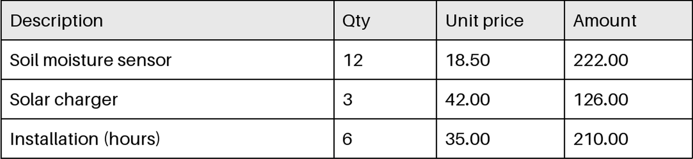

<!-- page: 1 -->

## INVOICE

Invoice no. INV-2026-0142  
Date: 15 September 2026  
Bill to: Riverside Community Garden

| Description | Qty | Unit price | Amount |
|---|---:|---:|---:|
| Soil moisture sensor | 12 | 18.50 | 222.00 |
| Solar charger | 3 | 42.00 | 126.00 |
| Installation (hours) | 6 | 35.00 | 210.00 |

Subtotal 558.00  
VAT 19% 106.02  
Total due (EUR) 664.02

Payment within 30 days. Thank you for supporting local growers.

Greenfield Sensors Ltd.  
12 Mill Lane, Leeds

<!-- ai-edited: Reformatted the invoice details and totals into separate lines to reflect the page’s reading order and layout. -->
