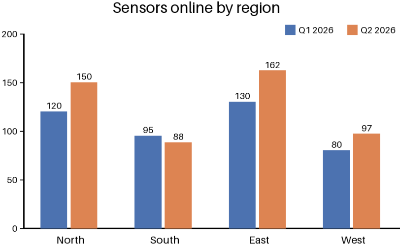
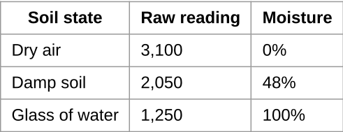

<!-- page: 1 -->

## Setting up a garden moisture sensor



> **AI-generated description:** A grouped bar chart titled “Sensors online by region” compares Q1 2026 and Q2 2026. Values are North 120 and 150, South 95 and 88, East 130 and 162, and West 80 and 97, respectively. Q2 is higher in North, East, and West, while Q1 is higher in South; East has the highest values and West the lowest.

A soil moisture sensor tells you when to water. This guide shows how to wire one to a small board, calibrate it and read values every ten minutes.

## What you need

- One capacitive soil moisture sensor
- A microcontroller board with an analogue input
- Three jumper wires and a USB cable

## Calibration values

| Soil state     |   Raw reading | Moisture   |
|----------------|---------------|------------|
| Dry air        |         3,100 | 0%         |
| Damp soil      |         2,050 | 48%        |
| Glass of water |         1,250 | 100%       |



## Reading the sensor

```python
import time

DRY, WET = 3100, 1250

def moisture(raw):
    return round(100 * (DRY - raw) / (DRY - WET))

while True:
```


<!-- ai-edited: Added the chart’s printed title, series, categories and values via an image description.; Reconstructed the code block from the visible formatted code; Docling had collapsed separate lines and blocks. -->

<!-- page: 2 -->

```python
print(moisture(read_adc()))
time.sleep(600)
```

Water the bed when the value stays below 20% for an hour.

<!-- ai-edited: Restored the code block structure and line break visible in the image.; Removed the site footer. -->
