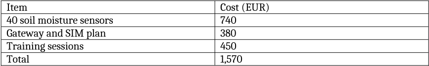

<!-- page: 1 -->

# Project Proposal: Community Sensor Network

## Background

Local growers lose crops every summer because they cannot see when soil dries out. This proposal extends the water sensor pilot into a permanent community network.

## Goals

- Keep at least 90% of sensors online through the year.
- Send growers a text message when soil moisture drops below 20%.
- Share anonymised readings with the regional water authority.

## Budget

| Item                     |   Cost (EUR) |
|--------------------------|--------------|
| 40 soil moisture sensors |          740 |
| Gateway and SIM plan     |          380 |
| Training sessions        |          450 |
| Total                    |        1,570 |

## Expected impact

The pilot already showed steady growth in three of four regions:

<!-- ai-edited: Changed the document title to an H1, matching the page's title styling.; Removed garbled bullet characters from the three goal items. -->
