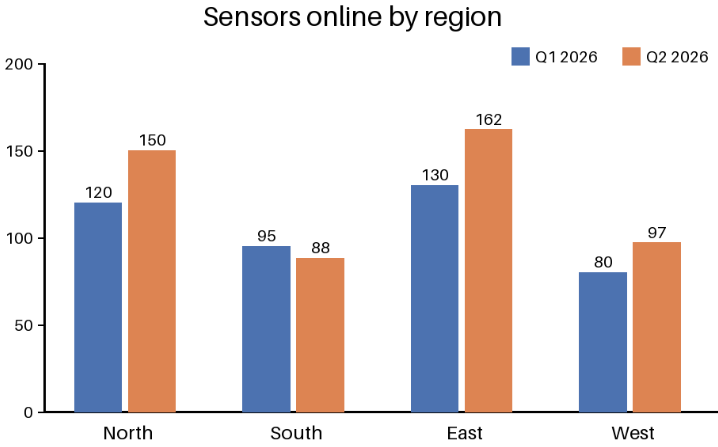

<!-- page: 2 -->

Figure 1: Sensors online per region during the pilot.

> **AI-generated description:** Grouped bar chart titled “Sensors online by region,” comparing Q1 2026 (blue) and Q2 2026 (orange) for North (120, 150), South (95, 88), East (130, 162), and West (80, 97). East has the most sensors online in both quarters; South has the fewest in Q2 2026.

<!-- ai-edited: Added an AI-generated description of the chart, including its printed title, legend, regions, and values. -->
