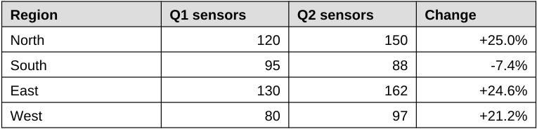
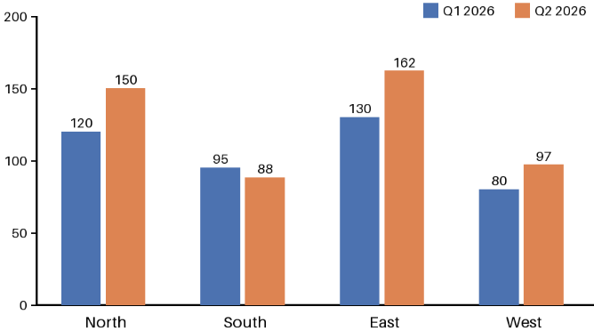

<!-- page: 1 -->

# Quarterly Field Report: Water Sensor Pilot

This report summarises the second quarter of the community water sensor pilot. Volunteers installed soil moisture sensors in four regions and logged how many stayed online.

## 1. Results by region

| Region   |   Q1 sensors |   Q2 sensors | Change   |
|----------|--------------|--------------|----------|
| North    |          120 |          150 | +25.0%   |
| South    |           95 |           88 | -7.4%    |
| East     |          130 |          162 | +24.6%   |
| West     |           80 |           97 | +21.2%   |

## Sensors online by region

Figure 1: Sensors online per region, Q1 and Q2 2026.

> **AI-generated description:** Grouped bar chart of sensors online by region, comparing Q1 2026 (blue) and Q2 2026 (orange). Values: North 120 and 150; South 95 and 88; East 130 and 162; West 80 and 97. East has the most sensors in Q2, and South is the only region to decline.

## 2. How growth is measured

Quarter-on-quarter growth for a region is computed as:

$$g = \frac{Q2 - Q1}{Q1} \times 100$$

A negative value means sensors went offline faster than new ones were installed.

<!-- ai-edited: Corrected the title to a document-level heading.; Reconstructed the displayed growth formula as a fraction and removed Docling's stray slash/escape characters.; Added a description of the chart image. -->
