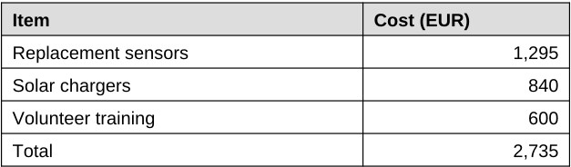

<!-- page: 2 -->

## 3. Next steps

- Replace the 7 failed sensors in the South region before October.
- Add a second solar charger to every West site.
- Publish the anonymised readings as open data in Q4.

## 4. Budget for Q3

| Item                |   Cost (EUR) |
|---------------------|--------------|
| Replacement sensors |        1,295 |
| Solar chargers      |          840 |
| Volunteer training  |          600 |
| Total               |        2,735 |

The pilot steering group will review these figures at its next meeting.
